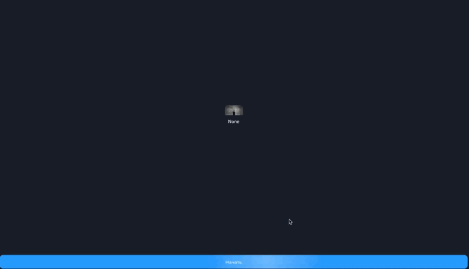

# 🤖Telegram bot shopping🛍️ 
чат-бот для telegram, где новые покупатели смогут оформлять свои заказы:
Интеграция с CMS Strapi
Telegram-магазин мечты!



## Как запустить?
- Склонируйте репозиторий ``` git clone https://github.com/Pavel2232/ShopBot```
- Активируйте виртуальное окружение ```poetry init```
- Установите зависимости проекта ```poetry install```
- Заполните .env 
```dotenv
TG_BOT_TOKEN=Получаете token у BotFather
REDIS_HOST=localhost
REDIS_PORT=6379(порт по умолчанию)
STRAPI_PRODUCT_TOKEN=Получаете в strapi token
API_STRAPI_URL=http://localhost:1337/api/
REDIS_URL=redis://localhost:6379/0
PAGINATION=2
```
- Установите [Node.js](https://nodejs.org/en/)
- Запустите через docker-compose redis и postgres
```shell
docker-compose up -d 
```
- Запустите strapi-cms локально
```shell
cd strapi-cms
npm run develop
```
- Запустите telegram bot
```shell
python3 main.py
```
